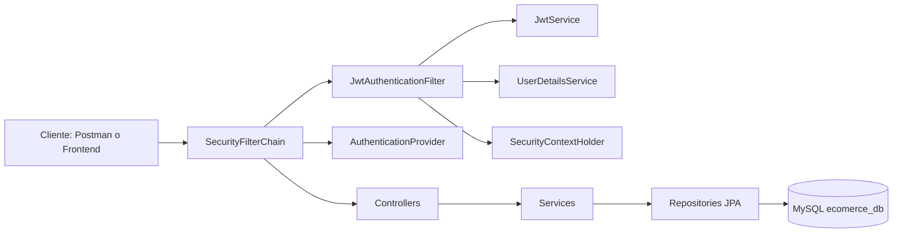

# Entrega tecnica - Arquitectura, DER y Endpoints

## 1) Diagrama de arquitectura

### 1.1 Capas + Security Filter Chain + persistencia

### 1.2 Flujo resumido de seguridad JWT

1. Cliente hace login en POST /api/auth/login.
2. AuthService valida credenciales y JwtService genera accessToken.
3. Cliente envia Authorization: Bearer <jwt> en endpoints protegidos.
4. JwtAuthenticationFilter extrae username y valida token.
5. Si el token es valido, se carga autenticacion en SecurityContext.
6. SecurityFilterChain aplica reglas por endpoint/metodo/rol.

### 1.3 Reglas de autorizacion globales

- Publicos: /api/health, /api/auth/**, /error.
- Productos POST/PUT/DELETE: roles VENDEDOR o ADMINISTRADOR.
- Metodos de pago POST/PUT/DELETE: solo ADMINISTRADOR.
- Todo lo demas: autenticado.

## 2) Listado completo de entidades (DER) y correspondencia

## 2.1 Entidad -> Clase Java -> Tabla BD

| Entidad DER | Clase Java | Tabla BD |
|---|---|---|
| Usuario | com.ecomerce.src.entity.User | usuario |
| Categoria | com.ecomerce.src.entity.Category | categoria |
| Producto | com.ecomerce.src.entity.Product | producto |
| Carrito | com.ecomerce.src.entity.Carrito | carrito |
| DetalleCarrito | com.ecomerce.src.entity.DetalleCarrito | detallecarrito |
| Compra | com.ecomerce.src.entity.Compra | compra |
| DetalleCompra | com.ecomerce.src.entity.DetalleCompra | detallecompra |
| DireccionEnvio | com.ecomerce.src.entity.DireccionEnvio | direccionenvio |
| Estado | com.ecomerce.src.entity.Estado | estado |
| MetodoPago | com.ecomerce.src.entity.MetodoPago | metodopago |

Notas:
- BaseEntity es superclase tecnica con id; no corresponde a tabla propia.
- En codigo algunas anotaciones usan mayusculas/comillas (por ejemplo "`Producto`"), pero en MySQL se persiste como producto por configuracion lower_case_table_names=1.

### 2.2 Relaciones principales del DER reflejadas en el modelo

- Usuario 1..N Producto (Product.usuarioId -> Usuario.id).
- Usuario 1..N Carrito (Carrito.usuarioId -> Usuario.id).
- Usuario 1..N Compra (Compra.idUsuario -> Usuario.id).
- Usuario 1..N DireccionEnvio (DireccionEnvio.idUsuario -> Usuario.id).
- Categoria 1..N Producto (Product.categoriaId -> Categoria.id).
- Carrito 1..N DetalleCarrito (DetalleCarrito.id_carrito -> Carrito.id).
- Producto 1..N DetalleCarrito (DetalleCarrito.id_producto -> Producto.id).
- Compra 1..N DetalleCompra (DetalleCompra.idCompra -> Compra.id).
- Producto 1..N DetalleCompra (DetalleCompra.idProducto -> Producto.id).
- Estado 1..N Compra (Compra.idEstado -> Estado.id).
- MetodoPago 1..N Compra (Compra.idMetodoPago -> MetodoPago.id).
- DireccionEnvio 1..N Compra (Compra.idDireccionEnvio -> DireccionEnvio.id).

## 3) Tabla completa de endpoints

Convencion columna Requiere auth/rol:
- Publico = no requiere token.
- Auth = requiere token valido.
- Auth + Rol = requiere token y rol especifico.

| HTTP | URL | Entidad/DTO | Requiere auth/rol |
|---|---|---|---|
| GET | /api/health | Health (Map status) | Publico |
| POST | /api/auth/register | RegisterRequest -> AuthResponse | Publico (regla de negocio: solo admin puede crear ADMINISTRADOR) |
| POST | /api/auth/login | AuthRequest -> AuthResponse | Publico |
| GET | /api/users | UserResponse[] | Auth |
| GET | /api/users/{id} | UserResponse | Auth |
| PUT | /api/users/{id} | UserRequest -> UserResponse | Auth (si modifica rol: admin en capa service) |
| DELETE | /api/users/{id} | User | Auth |
| GET | /api/users/{id}/compras | Compra[] | Auth |
| GET | /api/users/{id}/carrito | Carrito[] | Auth |
| GET | /api/users/{id}/direcciones | DireccionEnvio[] | Auth |
| GET | /api/productos | Product[] | Auth |
| GET | /api/productos/{id} | Product | Auth |
| POST | /api/productos | multipart -> ProductRequest -> Product | Auth + Rol (VENDEDOR o ADMINISTRADOR) |
| PUT | /api/productos/{id} | ProductRequest(JSON) -> Product | Auth + Rol (VENDEDOR o ADMINISTRADOR) |
| PUT | /api/productos/{id} | multipart -> ProductRequest -> Product | Auth + Rol (VENDEDOR o ADMINISTRADOR) |
| DELETE | /api/productos/{id} | Product | Auth + Rol (VENDEDOR o ADMINISTRADOR) |
| GET | /api/categorias | Category[] | Auth |
| GET | /api/categorias/{id} | Category | Auth |
| POST | /api/categorias | CategoryRequest -> Category | Auth |
| PUT | /api/categorias/{id} | CategoryRequest -> Category | Auth |
| DELETE | /api/categorias/{id} | Category | Auth |
| GET | /api/carrito | Carrito[] | Auth |
| GET | /api/carrito/{id} | Carrito | Auth |
| POST | /api/carrito | CarritoRequest -> Carrito | Auth |
| PUT | /api/carrito/{id} | CarritoRequest -> Carrito | Auth |
| DELETE | /api/carrito/{id} | Carrito | Auth |
| GET | /api/carrito/{idCarrito}/items | DetalleCarrito[] | Auth |
| POST | /api/carrito/{idCarrito}/items | DetalleCarritoRequest -> DetalleCarrito | Auth |
| PUT | /api/carrito/items/{idItem} | DetalleCarritoRequest -> DetalleCarrito | Auth |
| DELETE | /api/carrito/items/{idItem} | DetalleCarrito | Auth |
| POST | /api/compras/{idCarrito} | CompraRequest -> Compra | Auth |
| GET | /api/usuarios/{idUsuario}/compras | Compra[] | Auth |
| GET | /api/compras/{id} | Compra | Auth |
| PUT | /api/compras/{id} | CompraUpdateRequest -> Compra | Auth |
| GET | /api/compras/{id}/detalle | DetalleCompra[] | Auth |
| DELETE | /api/compras/{id} | Compra | Auth |
| GET | /api/detalle-compras | DetalleCompra[] | Auth |
| GET | /api/detalle-compras/{id} | DetalleCompra | Auth |
| POST | /api/detalle-compras | DetalleCompraRequest -> DetalleCompra | Auth |
| PUT | /api/detalle-compras/{id} | DetalleCompraRequest -> DetalleCompra | Auth |
| DELETE | /api/detalle-compras/{id} | DetalleCompra | Auth |
| GET | /api/direcciones | DireccionEnvio[] | Auth |
| GET | /api/direcciones/{id} | DireccionEnvio | Auth |
| POST | /api/direcciones | DireccionEnvioRequest -> DireccionEnvio | Auth |
| PUT | /api/direcciones/{id} | DireccionEnvioRequest -> DireccionEnvio | Auth |
| DELETE | /api/direcciones/{id} | DireccionEnvio | Auth |
| GET | /api/estados | Estado[] | Auth |
| GET | /api/estados/{id} | Estado | Auth |
| POST | /api/estados | EstadoRequest -> Estado | Auth |
| PUT | /api/estados/{id} | EstadoRequest -> Estado | Auth |
| DELETE | /api/estados/{id} | Estado | Auth |
| GET | /api/metodos-pago | MetodoPago[] | Auth |
| GET | /api/metodos-pago/{id} | MetodoPago | Auth |
| POST | /api/metodos-pago | MetodoPagoRequest -> MetodoPago | Auth + Rol (ADMINISTRADOR) |
| PUT | /api/metodos-pago/{id} | MetodoPagoRequest -> MetodoPago | Auth + Rol (ADMINISTRADOR) |
| DELETE | /api/metodos-pago/{id} | MetodoPago | Auth + Rol (ADMINISTRADOR) |

## 4) Evidencias solicitadas (capturas)

Se recomienda guardar las imagenes en docs/evidencias con los nombres sugeridos.

### 4.1 Capturas pedidas

1. Workbench - tablas visibles del schema ecomerce_db.
2. Workbench - datos visibles (usuario, producto, compra, detallecompra, carrito, detallecarrito).
3. Postman/cliente - login exitoso y JWT devuelto.
4. Postman/cliente - acceso a endpoint protegido con token (200).
5. Postman/cliente - endpoint sin token (401/403).
6. Postman/cliente - endpoint con rol insuficiente (403).

### 4.2 Evidencia tecnica ya verificada en ejecucion real (20-04-2026)

- Health: 200.
- Login comprador y vendedor: 200 con token JWT.
- Endpoint protegido sin token (GET /api/users): 403.
- Endpoint protegido con token (GET /api/users): 200.
- Rol insuficiente: POST /api/metodos-pago con vendedor -> 403.
- Rol insuficiente: intento de crear ADMINISTRADOR con vendedor -> 403.
- Flujo de negocio completo exitoso:
  - POST categoria: 201
  - POST producto: 201
  - POST direccion: 201
  - POST carrito: 201
  - POST item carrito: 201
  - POST compra: 201
  - POST detalle compra: 201

### 4.3 Estado de base de datos tras pruebas reales

Conteos observados:

- usuario: 3
- categoria: 1
- producto: 1
- carrito: 1
- detallecarrito: 1
- compra: 1
- detallecompra: 2
- direccionenvio: 3
- metodopago: 5

## 5) Link al repositorio y pasos minimos para ejecutar

- Repositorio publico: https://github.com/MaximoDiNapoli/Aplicaciones-Grupo2
- Pasos minimos en README: ver README.md en la raiz del repo.
